# Retevis C62


## [Retevis C62 Offical Web link](https://www.retevis.com/retevis-c62-5-w-long-range-uv-dual-band-ai-noise-reducation-business-radio-us)

## Links:

- [Video](https://youtu.be/Kko71ziv4Ik)

- [Tech Data](https://aijishu.com/a/1060000000360658)

- [Docs Center](https://docs2.listenai.com/x/af7lMsf-Scg)

- [git Dev link](https://cloud.listenai.com/CSKG962172/duomotai_ap)

- [Firmware over UART burn/flash instructions](https://docs2.listenai.com/x/x61KemJ0eYx) -- Note: See below for firmware dump instructions.

- [SWD Firmware Burn instuctions](https://docs2.listenai.com/x/kOtM5RItJc2)

## Docker development
- [SDK](https://docs2.listenai.com/x/xfI6rkDCKmW)
- [Docker Dev UDEV instructions](https://docs2.listenai.com/x/ZPt-N8iM3FU#linux系统下无法识别到csk-usb设备)
- [Docker Dev FAQ](https://docs2.listenai.com/x/ZPt-N8iM3FU#linux-系统docker环境csk6集成开发环境常见问题及解决方法)
- The listenai docs are incorrect on the exact format of the docker run command, see below for the correct command.
- The --platform linux/amd64 option is only required if you're using an M series Mac in order to force docker to pull the correct image as there is no M series Mac docker image -- this pulls the Linux X64 image and runs it under Rosetta.
- docker pull --platform linux/amd64 listenai/csk6
- docker run --platform linux/amd64 --privileged -v /dev:/dev -v /run/udev:/run/udev -it listenai/csk6:latest


## Pics / dissassembly instructions: 

Take out the four screws in the corners:
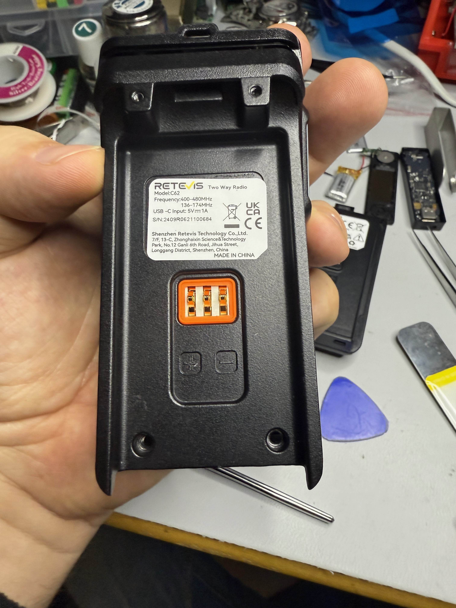

Remove the volume knob and the antenna nut and the volume knob retention nut:
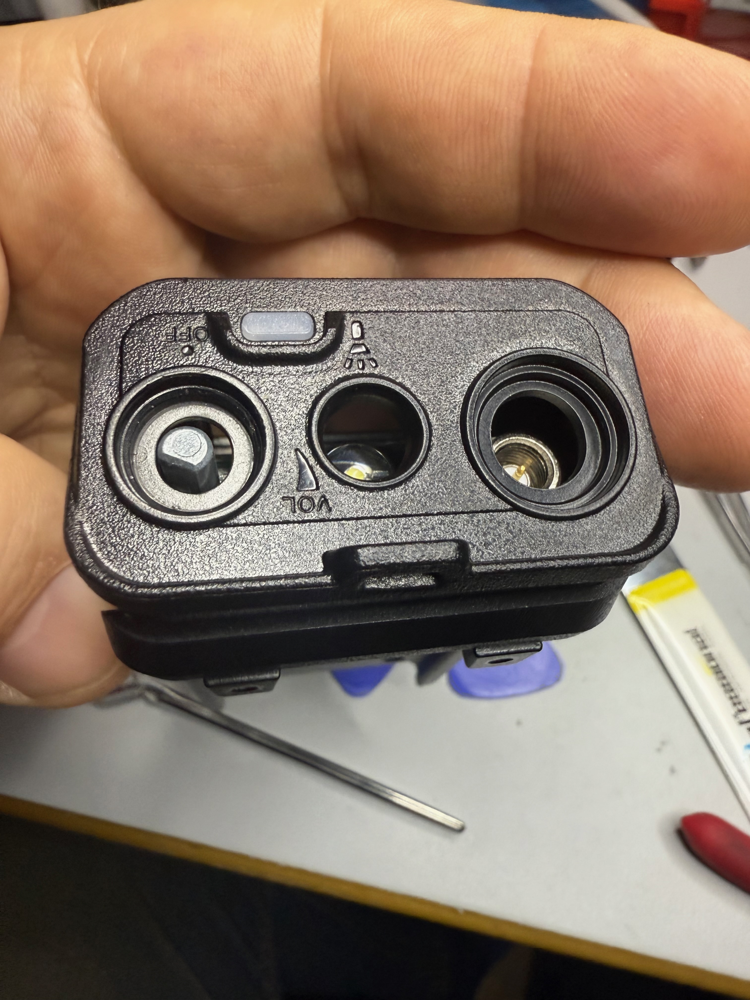

Gently pry the back up -- the cable is too short, and electrical taped:
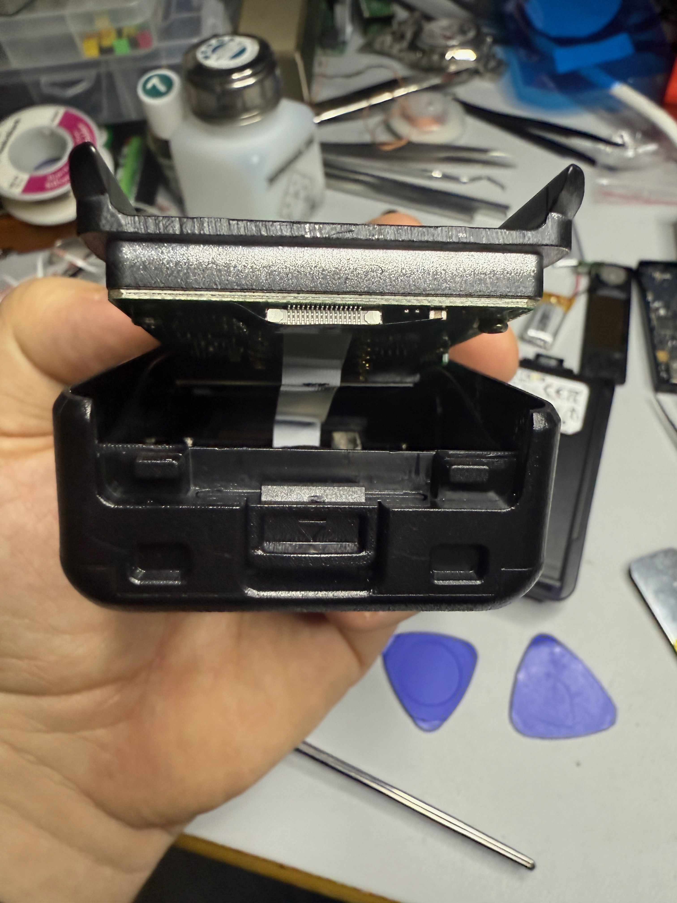

Slide the cable retention open and remove the cable:
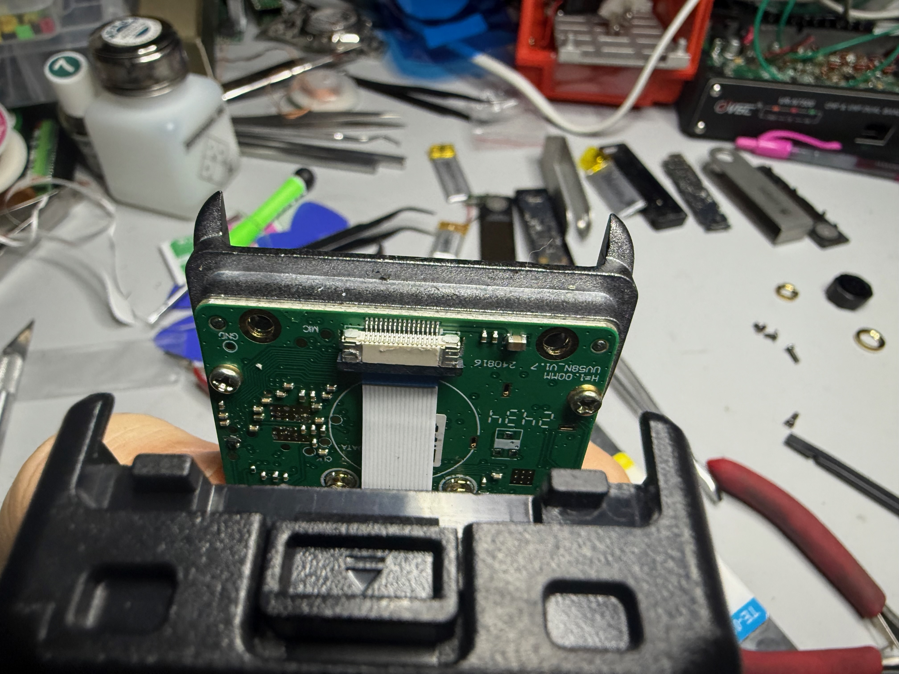

*Carefully* pry the screen up -- there are two clips holding it on in the center of the top and bottom of the screen.  There are three screws under the screen so you have to remove it:
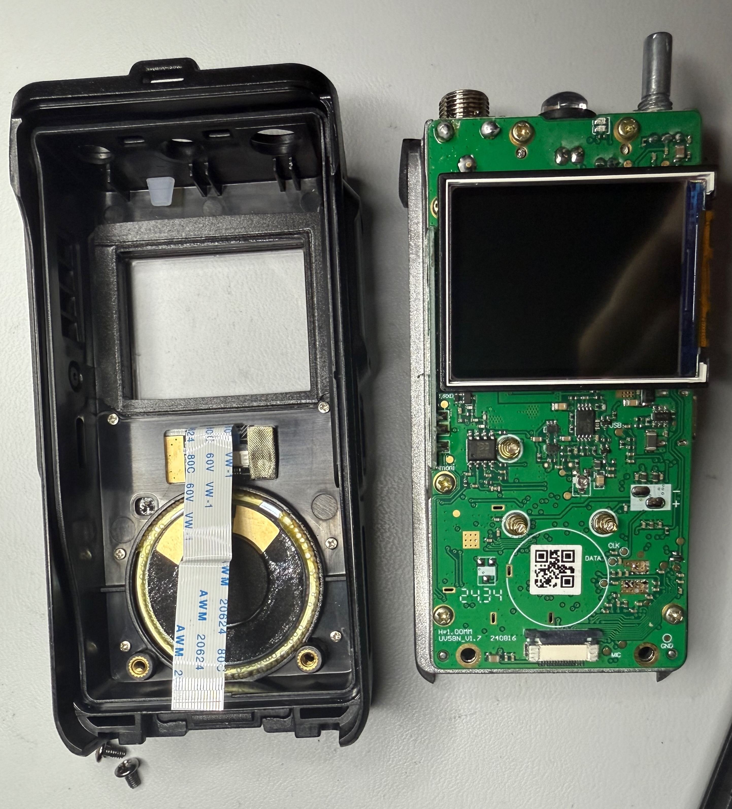

Remove all the screws:
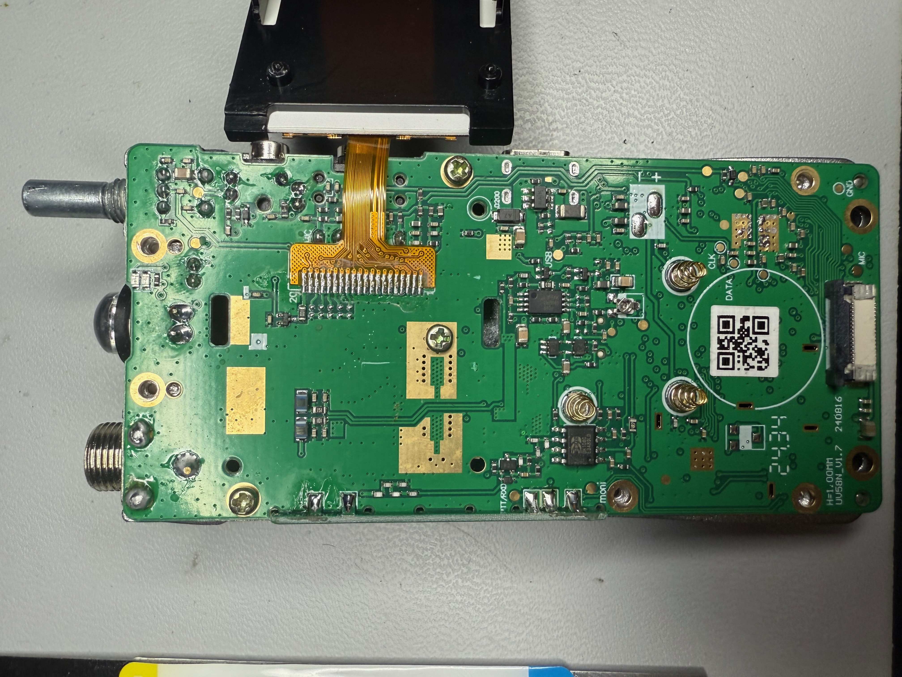

Gently separate the board from the back:
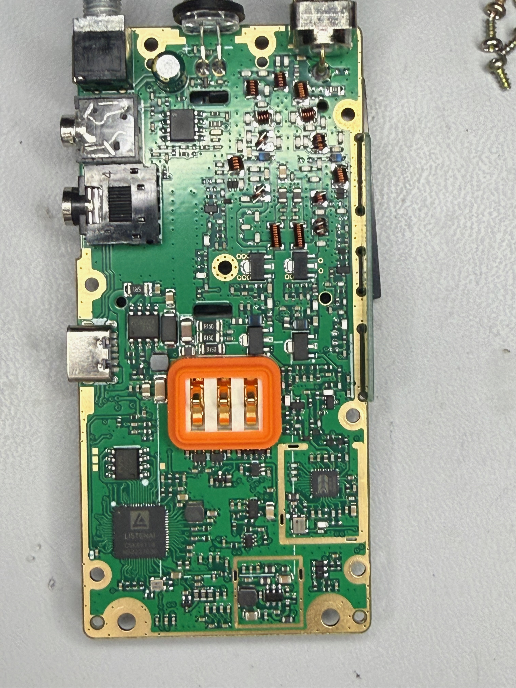

BK1080 -- FM Receiver chip
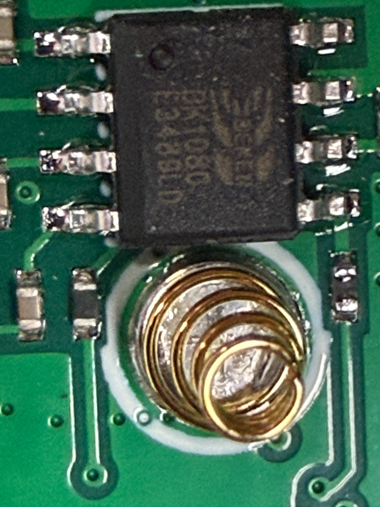

RF Front end -- BK4819, same as the chip in the UV-K5 radios: 
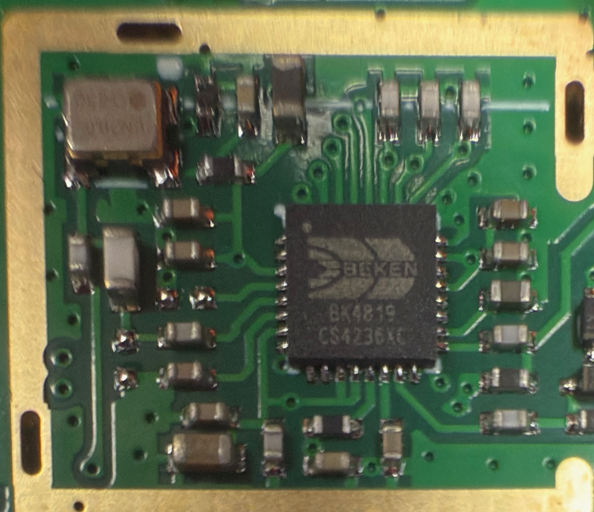

ListenAI CSK6011B:
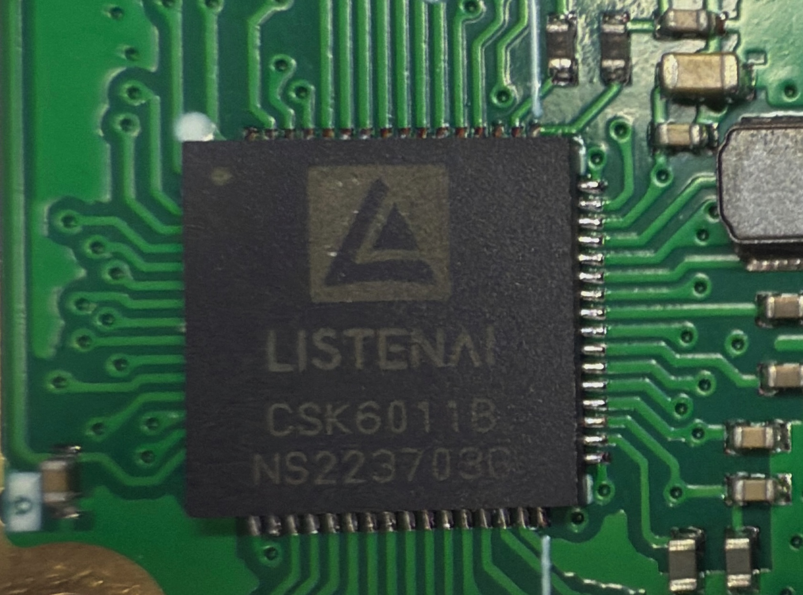

Debug pads on the opposite side of the CSK6011B:
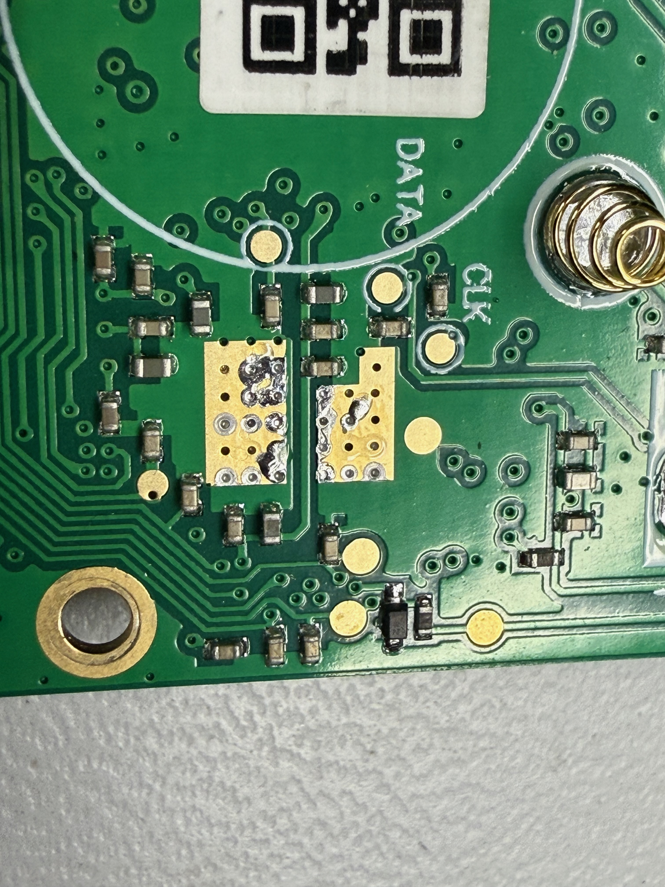

## Reverse Engineering
- It is possible to download the firmware from the radio, at least in the versions that we have seen.
- cskburn is broken in the official repo for reading firmware.  In order to use it, you need to download Andy's (OE3ANC) fork of the official tool from: [OE3ANC cskburn](https://github.com/OE3ANC/cskburn)
- Once you have built that tool, the command line to download the radio is: ```cskburn --read "0x0000000:4096000:app.bin" -C 6 -b 115200 -v -s {your usb or serial device}```
- The only cable I was able to make work with the radio was the TalkPod A36 programming cable, and that required downloading drivers from the manufacturer.  YMMV, the Retevis cable should work but I didn't have it at the time.  
- I have not yet been able to put together a reasonable memory map that allows me to study the decompiled code thoroughly.  It does decompile using ghidra's armv8-LE processor definitions, but I do not believe that is actually a fully accurate processor file for this chip.  
- PRs are welcome, especially if you know how to properly decompile code built for the listenai CSK6011B chip.  